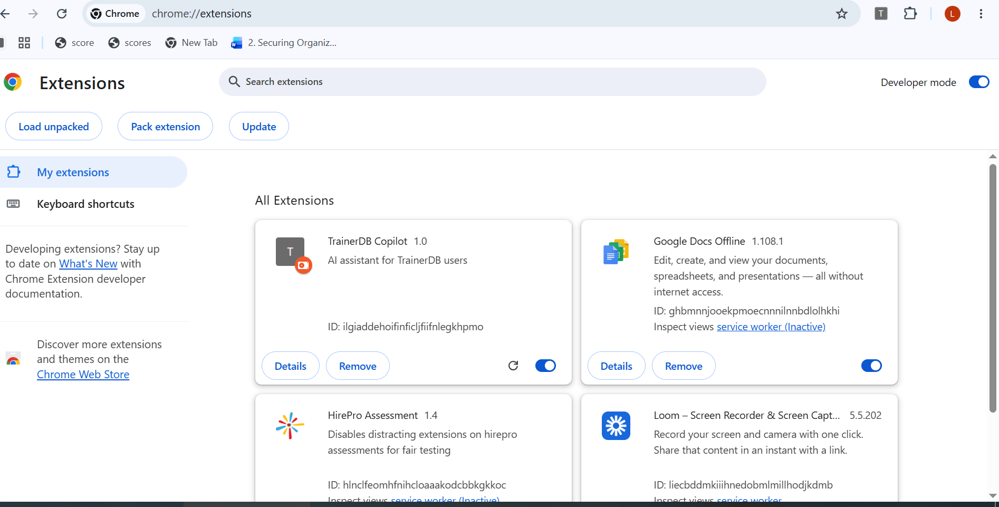
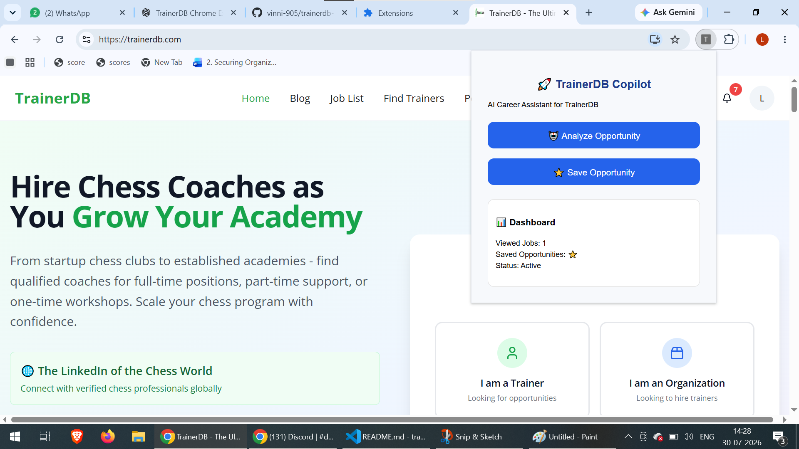
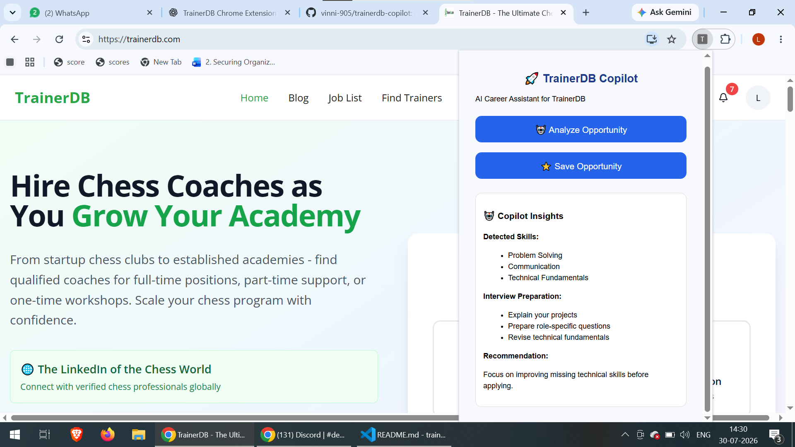
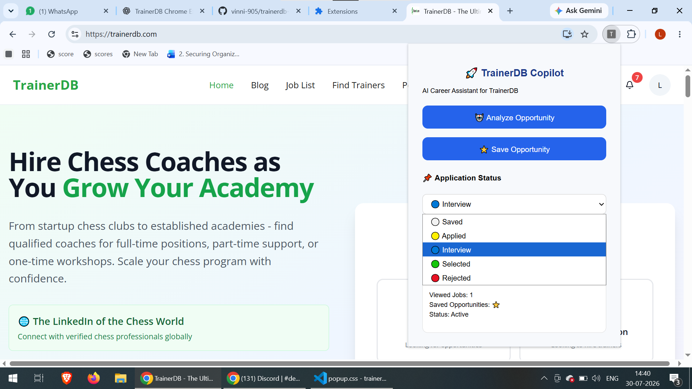
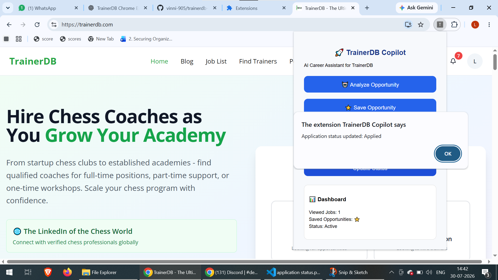

# 🚀 TrainerDB Copilot

AI-powered Chrome extension that improves the TrainerDB experience by helping users analyze opportunities, identify required skills, and track saved jobs.

## 📌 Problem

Users often spend time reading job descriptions, understanding requirements, and managing multiple opportunities.

TrainerDB Copilot solves this by adding an intelligent assistant directly inside the browser.

## 💡 Solution

TrainerDB Copilot provides:

- AI-assisted job analysis
- Skill identification
- Interview preparation suggestions
- Opportunity bookmarking

## ✨ Features

### 🤖 AI Opportunity Analyzer

Analyzes job information and provides:

- Required skills
- Interview preparation topics
- Learning suggestions

### ⭐ Smart Opportunity Tracker

Users can:

- Save interesting opportunities
- Track career activities

### 📊 Dashboard

Quick overview of saved opportunities and user activity.

## 🛠️ Technologies Used

- HTML
- CSS
- JavaScript
- Chrome Extension Manifest V3
- Chrome Storage API

## ⚙️ Installation

1. Download or clone this repository.

2. Open Chrome:
chrome://extensions/

3. Enable Developer Mode.

4. Click Load unpacked.

5. Select the trainerdb-copilot folder.

6. Open TrainerDB and use the extension.

## 🚀 Future Improvements

- Real AI API integration
- Resume matching
- Application reminders
- Advanced analytics
## 📸 Screenshots

### Chrome Extension

### TrainerDB Copilot Popup

### AI Analysis

### Application Status Tracker

### Updated Copilot Dashboard

